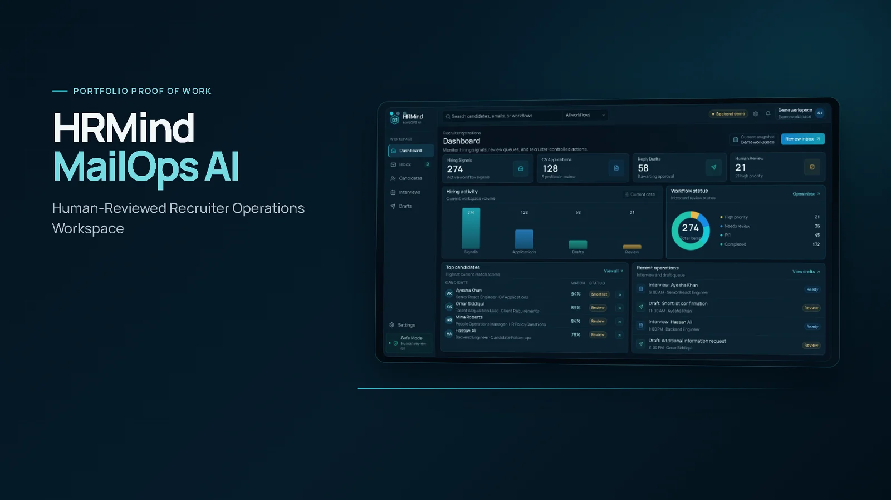
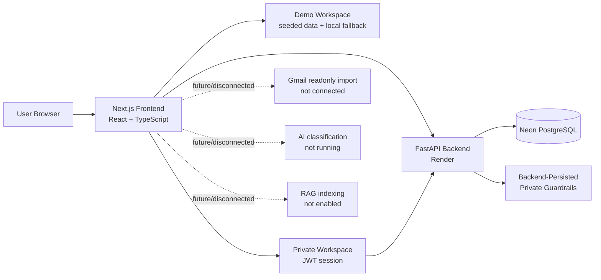
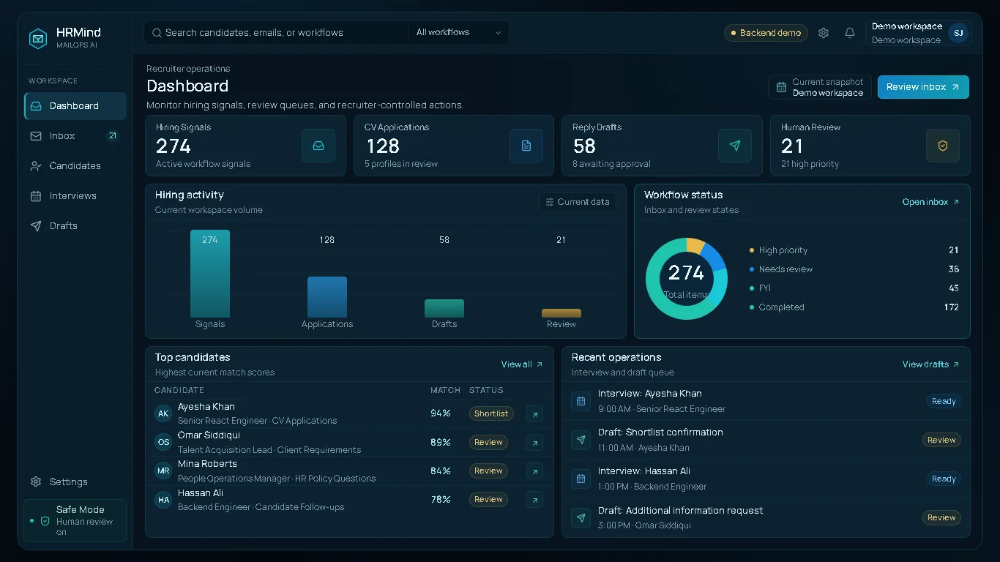
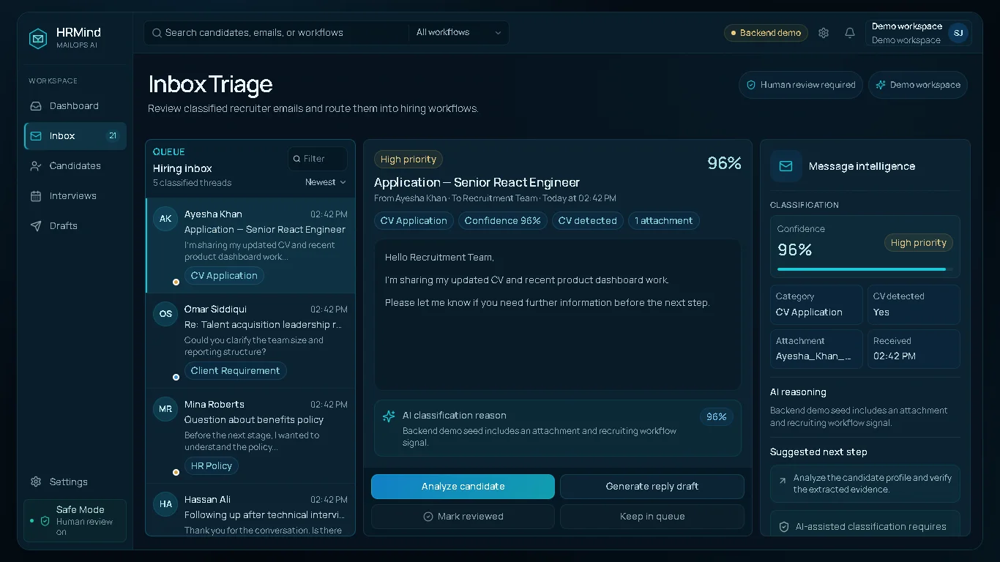
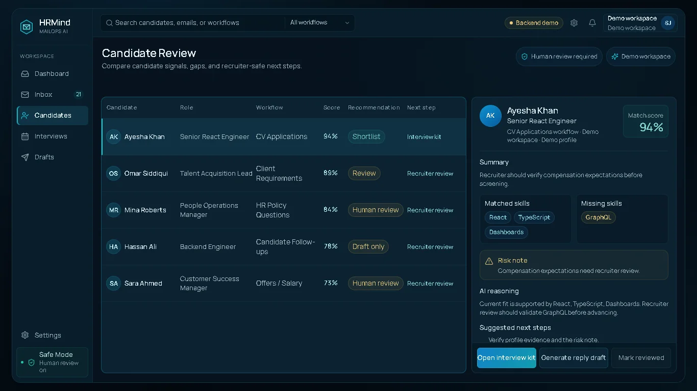
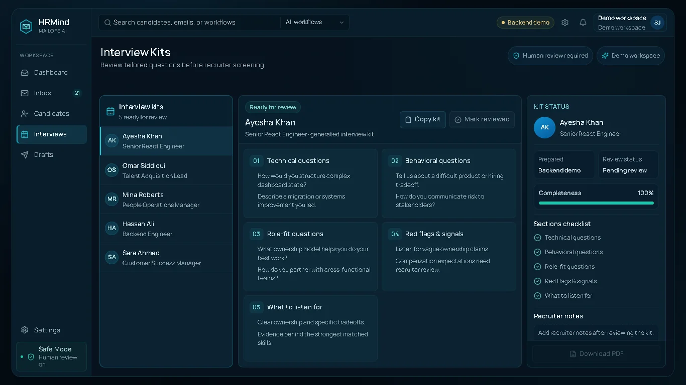
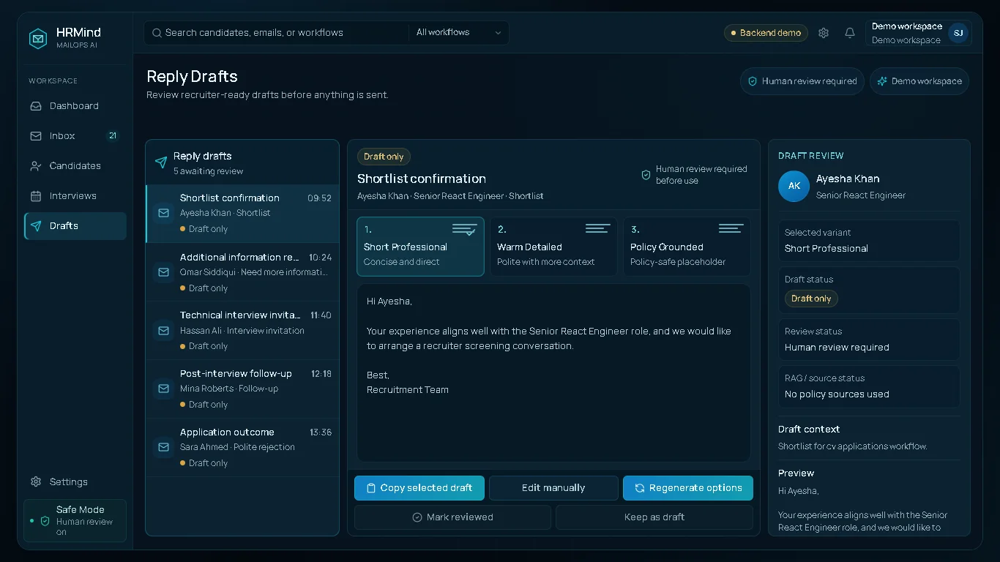
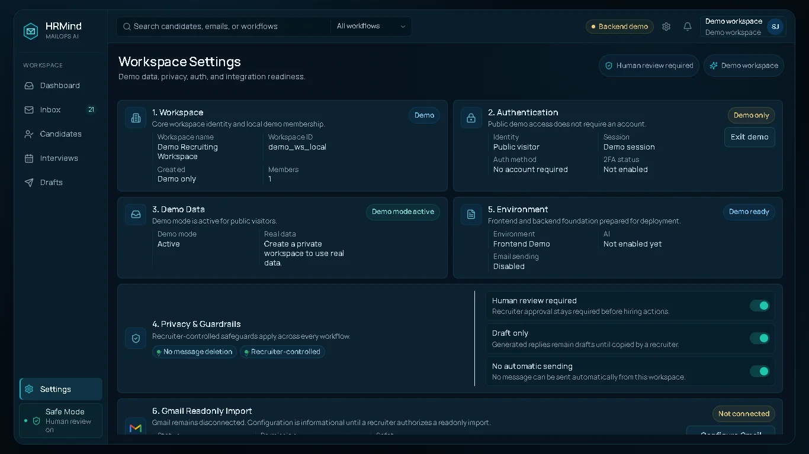

# HRMind MailOps AI

[](https://hrmind-mailops-ai.vercel.app)

Human-reviewed recruiter operations workspace for inbox triage, candidate review, interview preparation, and reply drafting.

- Live Demo: [https://hrmind-mailops-ai.vercel.app](https://hrmind-mailops-ai.vercel.app)
- GitHub Repository: [https://github.com/shaheerhus85-dev/hrmind-mailops-ai](https://github.com/shaheerhus85-dev/hrmind-mailops-ai)
- Portfolio: [https://shaheer-portfolio-three.vercel.app](https://shaheer-portfolio-three.vercel.app)
- Current Status: Deployed Portfolio Proof of Work

## Overview

Recruiting work is often split between inboxes, candidate notes, interview documents, and reply drafts. HRMind MailOps AI explores how those tasks can be organized inside one structured workspace while keeping recruiters responsible for every important decision.

This is a full-stack portfolio proof-of-work project. It demonstrates product architecture, recruiter workflow design, authentication, backend persistence, and a polished human-reviewed interface. It is not a production ATS, a connected Gmail automation system, or an autonomous recruiting platform.

## Core Workflow

1. Enter the Demo workspace or create a Private workspace.
2. Review recruiter activity from the Dashboard.
3. Organize messages through Inbox Triage.
4. Review candidate context, recommendation, workflow, and next step.
5. Prepare structured Interview Kits.
6. Review multiple Reply Draft variants.
7. Keep human review and draft-only guardrails enabled.

## Product Workspaces

### Dashboard

Operational view of recruiter activity, workflow counts, workspace state, and recent review activity.

### Inbox Triage

Message queue, recruiter context, classification sections, priority labels, and review actions. The current interface presents structured demo data and does not run live AI classification.

### Candidate Review

Candidate table, workflow context, recommendation labels, match context, missing skills, risk notes, and next steps. Recommendation and match details are demo/workspace data, not live Gemini scoring.

### Interview Kits

Structured technical, behavioral, role-fit, red-flag, and recruiter listening questions for candidate preparation.

### Reply Drafts

Multiple draft styles with review, editing, regeneration UI, copy actions, and keep-as-draft behavior. HRMind does not send emails.

### Settings

Workspace identity, authentication details, privacy guardrails, environment state, Gmail connection direction, and local RAG metadata staging. Private workspace guardrails persist through the backend; RAG file metadata remains local-only.

## Demo and Private Workspaces

| Area | Demo Workspace | Private Workspace |
| --- | --- | --- |
| Access | Available without signup | Signup and login |
| Data | Preloaded structured demonstration data | Empty private workflow states until integrations or data are added |
| Authentication | Public demo session in the browser | Email/password login with JWT authentication |
| Persistence | Local browser fallback for demo state and settings; demo reads can come from the backend when configured | Authenticated workspace identity and backend-persisted guardrail settings |
| Separation | Suitable for product exploration | Separated from Demo workspace data |

## What Is Live

- Production frontend on Vercel
- Production FastAPI backend on Render
- Demo workspace with backend reads and local fallback behavior
- Private signup and login
- JWT authentication
- PostgreSQL persistence through Neon
- Private workspace identity
- Persisted private guardrail settings
- Dashboard
- Inbox Triage workspace
- Candidate Review workspace
- Interview Kits
- Reply Draft workflows
- Local RAG source metadata staging
- Demo/private state separation
- Visual and state QA scripts

## Current Boundaries

The current version is intentionally human-reviewed and draft-only. These boundaries are part of the product scope and safety model:

- Gmail OAuth is not connected.
- Live Gmail inbox import is not connected.
- Live AI message classification is not running.
- Gemini candidate analysis is not running.
- Production RAG file uploading is not connected.
- RAG indexing and retrieval are not enabled.
- Automatic email sending is disabled.
- Mailbox deletion, relabeling, and mutation are not implemented.

## Architecture



## Tech Stack

### Frontend

- Next.js 16.2.9
- React 19.2.7
- TypeScript 5.5.3
- Manrope Variable
- lucide-react icons
- GSAP for subtle interface motion
- Custom responsive CSS

### Backend

- Python
- FastAPI
- Pydantic
- SQLAlchemy
- Alembic
- Uvicorn
- python-dotenv

### Database and Authentication

- PostgreSQL through Neon
- JWT authentication with PyJWT
- Password hashing with passlib and bcrypt
- Email validation with email-validator

### Deployment

- Vercel frontend
- Render backend
- Neon PostgreSQL

### Quality

- TypeScript checking
- Production build
- Playwright-based visual QA
- State and persistence QA
- Backend verification scripts

## Screenshots

<details open>
<summary>Dashboard</summary>



Operational overview of recruiter activity, workflow counts, and workspace status.

</details>

<details>
<summary>Inbox Triage</summary>



Recruiter message triage with priority labels, context, and review actions.

</details>

<details>
<summary>Candidate Review</summary>



Candidate context, recommendation labels, match details, risks, and next steps.

</details>

<details>
<summary>Interview Kits</summary>



Technical, behavioral, role-fit, red-flag, and listening prompts for interview preparation.

</details>

<details>
<summary>Reply Drafts</summary>



Draft variants remain review-only and are never sent automatically.

</details>

<details>
<summary>Settings and Guardrails</summary>



Workspace identity, privacy guardrails, Gmail direction, and local RAG metadata staging.

</details>

## Safety and Product Principles

- Human review remains required.
- Replies remain draft-only.
- No automatic email sending is enabled.
- Gmail remains disconnected.
- Demo and Private workspace data remain separated.
- Local RAG metadata is not uploaded or indexed.
- The interface distinguishes live features from planned integrations.

## Local Development

### Frontend

```bash
npm install
npm run dev
```

Open the frontend at:

```text
http://localhost:3000
```

Frontend environment variables are documented in [.env.example](.env.example):

```env
NEXT_PUBLIC_BACKEND_URL=
NEXT_PUBLIC_FIREBASE_API_KEY=
NEXT_PUBLIC_FIREBASE_AUTH_DOMAIN=
NEXT_PUBLIC_FIREBASE_PROJECT_ID=
NEXT_PUBLIC_FIREBASE_APP_ID=
```

The deployed frontend uses `NEXT_PUBLIC_BACKEND_URL` to talk to the FastAPI backend. Firebase public variables are optional empty entries in the example file; current private workspace authentication is handled by the FastAPI backend and JWT routes.

### Backend

```bash
cd backend
python -m venv .venv
.venv\Scripts\activate
pip install -r requirements.txt
Copy-Item .env.example .env
alembic upgrade head
python -m app.seed
uvicorn app.main:app --reload --port 8000
```

Backend environment variables are documented in [backend/.env.example](backend/.env.example):

```env
DATABASE_URL=
BACKEND_ENV=
BACKEND_CORS_ORIGINS=
JWT_SECRET=
JWT_EXPIRES_MINUTES=
```

Useful backend endpoints:

- Health: `http://localhost:8000/health`
- OpenAPI: `http://localhost:8000/docs`

## Quality Checks

```bash
npm run typecheck
npm run build
npm run qa:visual
npm run qa:state
```

- `npm run typecheck` checks the TypeScript project with `tsc --noEmit`.
- `npm run build` creates a production Next.js build.
- `npm run qa:visual` runs Playwright visual and workflow checks against a local frontend server.
- `npm run qa:state` verifies local demo state and persistence behavior against a local frontend server.

Backend checks are available under `backend/scripts/`, including `check_backend.py` and `check_auth.py`.

## Roadmap

- Gmail readonly inbox import
- Live message classification
- AI-assisted candidate review
- Knowledge-base file storage and indexing
- Recruiter report export
- Team and role permissions
- Continue keeping outbound communication human-reviewed

## Project Purpose

HRMind is a portfolio proof-of-work project showing Shaheer Hussain Jafri's approach to:

- Full-stack development
- Workflow systems
- Backend architecture
- Authentication and persistence
- Product-level UI/UX
- AI-assisted development
- Honest technical documentation

## Author

Shaheer Hussain Jafri

- LinkedIn: [https://www.linkedin.com/in/shaheer-hussain-jafri](https://www.linkedin.com/in/shaheer-hussain-jafri)
- GitHub: [https://github.com/shaheerhus85-dev](https://github.com/shaheerhus85-dev)
- Portfolio: [https://shaheer-portfolio-three.vercel.app](https://shaheer-portfolio-three.vercel.app)
- Location: Karachi, Pakistan
