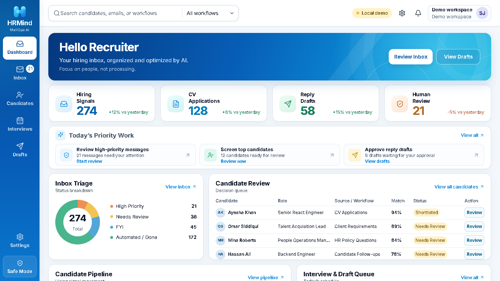
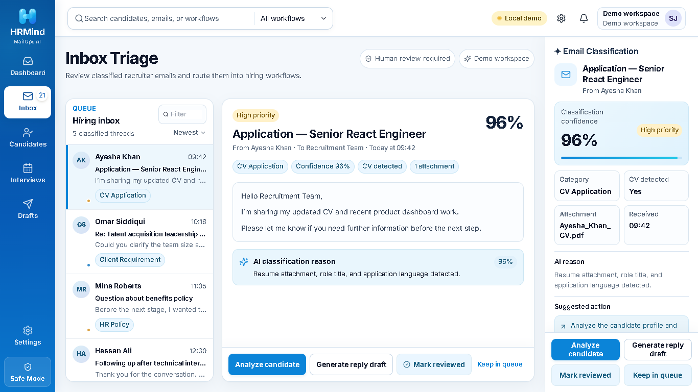
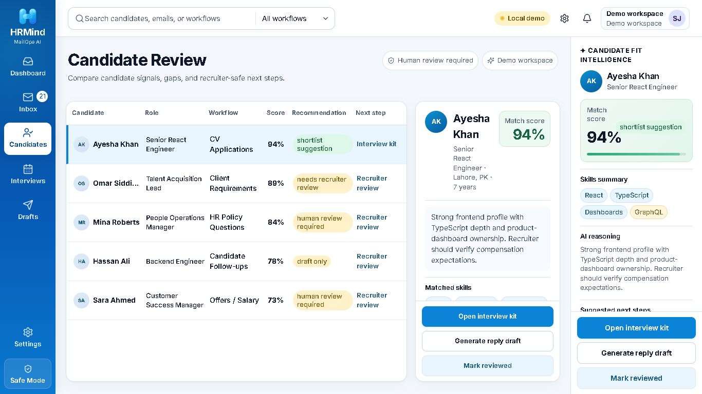
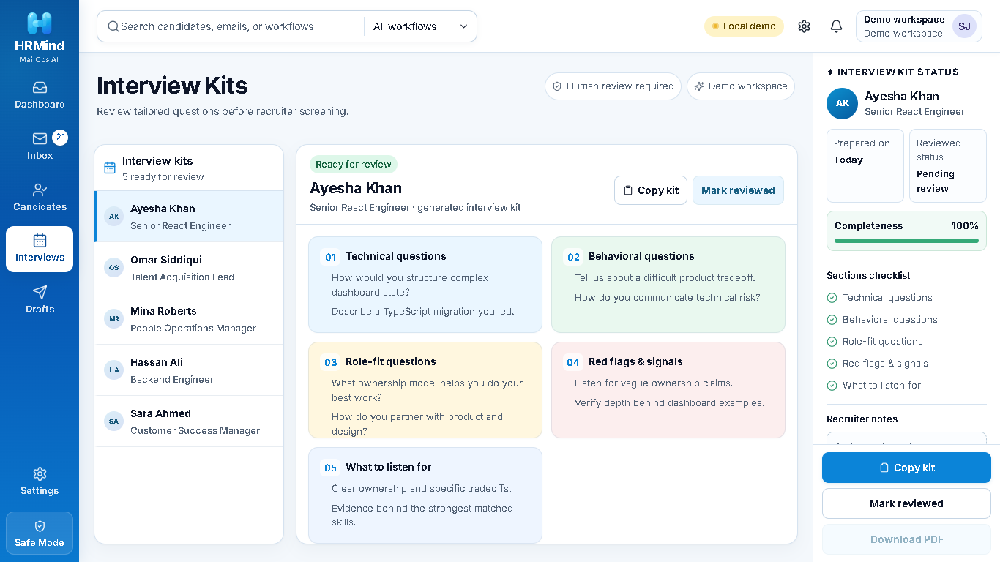
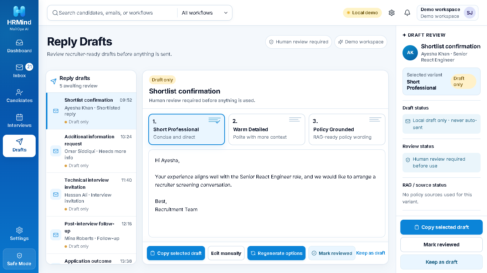
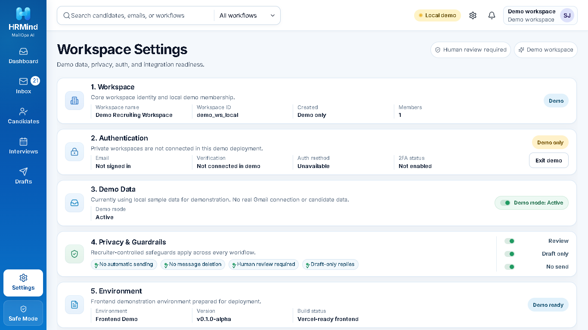
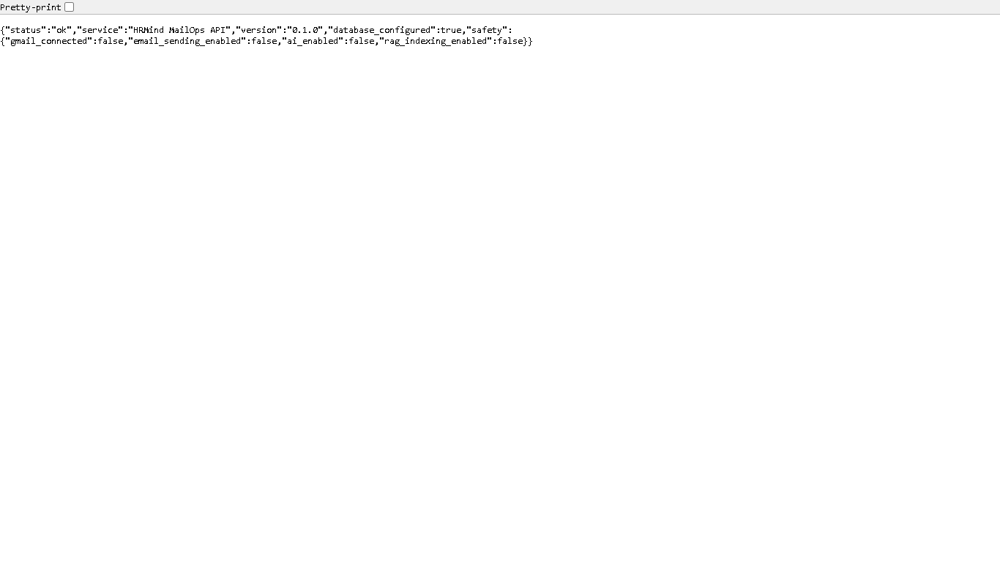

# HRMind MailOps AI

Recruiter Operations Workspace

HRMind MailOps AI is a portfolio proof-of-work prototype for recruiter email operations, candidate review, interview preparation, safe reply drafting, and future knowledge-base workflows.

## Project overview

HRMind MailOps AI explores what a recruiter-facing operations workspace could look like when email triage, candidate context, interview kits, draft replies, and workspace settings live in one focused interface.

The project is intentionally built as a polished demonstration, not as a production SaaS. The current frontend is live on Vercel as a safe portfolio demo, and it reads demo workspace data from a live Render FastAPI backend backed by Neon PostgreSQL. Settings changes and RAG document staging remain safe local browser interactions.

The product direction is recruiter-friendly and safety-first: no automatic email sending, no automatic hiring decisions, and human review remains required.

## Problem

Recruiting teams often work across fragmented tools:

- candidate emails in one place;
- resumes, requirements, and policy references elsewhere;
- interview preparation in separate documents;
- reply drafts recreated manually;
- sensitive decisions requiring careful human review.

This makes recruiter operations slower, harder to audit, and easier to mis-handle when communication volume grows.

## Solution

HRMind MailOps AI prototypes a single recruiter operations workspace where a recruiter can:

- review prioritized inbox-style threads;
- inspect candidate summaries and risk notes;
- prepare interview kits;
- generate and review safe reply drafts;
- manage workspace guardrails;
- stage knowledge-base document metadata locally for future RAG workflows.

The current implementation focuses on the product workflow, UI quality, safety posture, and backend foundation. It does not claim live Gmail, live AI, live RAG indexing, or production email automation.

## Core workflow

1. Open the live portfolio demo workspace.
2. Review recruiter operations metrics on the dashboard.
3. Triage sample candidate and recruiting-related email threads.
4. Review candidate fit, skills, gaps, and risk notes.
5. Prepare interview kits with structured question groups.
6. Inspect reply draft variants.
7. Keep all communication under human review.
8. Configure local demo settings and guardrails.
9. Stage RAG source metadata locally for a future backend indexing phase.

## Key features

- Polished recruiter operations dashboard.
- Inbox triage interface for sample recruiting emails.
- Candidate review workspace with match signals, skills, gaps, and next steps.
- Interview kit view with technical, behavioral, and role-fit prompts.
- Reply draft workspace with multiple draft variants.
- Workspace Settings panel with local guardrail controls.
- Local RAG metadata staging for PDF, DOCX, and TXT files.
- Demo-safe authentication messaging when private workspaces are unavailable.
- Backend adapter layer with live backend reads and local fallback behavior.
- FastAPI + PostgreSQL backend foundation with migrations, seed data, and API routes.

## Safety guardrails

HRMind MailOps AI is designed around recruiter control.

- No automatic email sending.
- No message deletion.
- No Gmail relabeling or mailbox mutation.
- Human review required.
- Draft-only reply behavior.
- No automatic hiring decisions.
- Local demo data remains local.
- RAG file staging stores metadata locally in the frontend demo.
- Backend routes do not call Gmail, AI APIs, file storage, or RAG indexing.

## Tech stack

Frontend:

- Next.js
- React
- TypeScript
- CSS modules/global styling
- GSAP for subtle UI motion
- localStorage-backed demo state
- Playwright-based visual/state QA scripts

Backend:

- FastAPI
- PostgreSQL
- SQLAlchemy
- Alembic
- Pydantic
- python-dotenv
- Uvicorn

## Frontend architecture

The frontend is a Next.js application that currently runs as a safe live portfolio demo workspace.

Key frontend pieces:

- single-page recruiter workspace experience;
- demo workspace state persisted locally;
- Settings controls persisted locally;
- local RAG metadata staging and removal;
- guarded auth screens that explain private workspaces are not connected in the demo deployment;
- backend adapter abstraction under `lib/backend/`.

The adapter layer provides a simple interface for future backend wiring:

- `getWorkspace()`
- `saveSettings()`
- `getSettings()`
- `listEmailThreads()`
- `listCandidates()`
- `listDrafts()`
- `saveDraft()`
- `stageRagSourceMetadata()`
- `clearDemoSettings()`

When `NEXT_PUBLIC_BACKEND_URL` is configured, the frontend uses the backend API adapter for demo workspace read operations. If the backend is unavailable, it falls back to the local demo adapter so the demo remains usable. Settings updates, draft edits, and RAG source staging remain local demo interactions.

## Backend architecture

The backend foundation lives under `backend/` and is implemented with FastAPI and PostgreSQL.

It includes:

- FastAPI application entrypoint;
- environment-based configuration;
- SQLAlchemy database session setup;
- SQLAlchemy models;
- Pydantic schemas;
- API route modules;
- Alembic migration configuration;
- an initial schema migration;
- idempotent demo seed data;
- a backend verification script.

Implemented API route groups include:

- `GET /health`
- `GET /api/workspaces/demo`
- `GET /api/settings/{workspace_id}`
- `PATCH /api/settings/{workspace_id}`
- `GET /api/email-threads/{workspace_id}`
- `GET /api/candidates/{workspace_id}`
- `GET /api/drafts/{workspace_id}`
- `PATCH /api/drafts/{draft_id}`
- `GET /api/interview-kits/{workspace_id}`
- `GET /api/rag-sources/{workspace_id}`
- `POST /api/audit-logs`

## Database entities

The PostgreSQL schema currently includes:

- `users`
- `workspaces`
- `workspace_settings`
- `email_threads`
- `candidates`
- `reply_drafts`
- `interview_kits`
- `rag_sources`
- `audit_logs`

The demo seed creates a stable local demo workspace with sample recruiting data for candidates, email threads, drafts, interview kits, and default guardrail settings.

## Current status

Implemented and verified:

- live Vercel frontend demo workspace;
- live Render FastAPI backend;
- Neon PostgreSQL connection;
- backend-backed demo workspace reads;
- visible “Backend demo” status label when the live backend is available;
- local demo mode without login;
- local Settings controls and persistence;
- local RAG metadata staging and removal;
- backend adapter with safe local fallback;
- FastAPI backend foundation;
- PostgreSQL schema and Alembic migration;
- idempotent backend seed script;
- database-backed backend route verification against PostgreSQL;
- frontend typecheck and production build.

This is still a portfolio proof-of-work. The frontend and backend are intentionally not presented as a production SaaS.

Live demo links:

- Frontend live demo: [https://hrmind-mailops-ai.vercel.app](https://hrmind-mailops-ai.vercel.app)
- Backend health endpoint: [https://hrmind-mailops-api.onrender.com/health](https://hrmind-mailops-api.onrender.com/health)

## What is intentionally not implemented yet

The following are not live:

- Gmail OAuth;
- Gmail readonly import;
- real mailbox access;
- email sending;
- email deletion or relabeling;
- real AI classification;
- real RAG indexing or retrieval;
- Firebase/Supabase production auth;
- file upload storage;
- production billing, tenancy, or deployment hardening.

## Roadmap

Planned next phases:

- add private workspace authentication;
- keep demo workspace separate from private workspaces;
- add readonly Gmail import after explicit recruiter approval flows are designed;
- add document upload storage and backend RAG indexing;
- add AI-assisted classification with transparent confidence and audit trails;
- expand audit logging;
- strengthen production deployment, observability, and security posture.

## Local setup

### Frontend

Install dependencies and run the local demo:

```bash
npm install
npm run dev
```

Open:

```text
http://localhost:3000
```

Useful frontend checks:

```bash
npm run typecheck
npm run build
npm run qa:visual
npm run qa:state
```

The visual QA script expects the frontend to be running on `localhost:3000`.

### Backend

See `backend/README.md` for detailed PostgreSQL setup, Alembic migration commands, seed commands, and runtime verification.

Typical backend flow:

```bash
cd backend
python -m venv .venv
.venv\Scripts\activate
pip install -r requirements.txt
copy .env.example .env
alembic upgrade head
python -m app.seed
uvicorn app.main:app --reload --port 8000
python scripts/check_backend.py
```

Keep local secrets and runtime data out of git:

- `backend/.env`
- `backend/.venv/`
- `backend/.pgdata/`
- `backend/pg-runtime.log`

## Screenshots

See the full case study: [HRMind MailOps AI case study](docs/case-study.md).

### Dashboard overview



### Inbox Triage



### Candidate Review



### Interview Kits



### Reply Drafts



### Workspace Settings



### Backend health/API



## Author

Built by Shaheer Hussain Jafri as a portfolio proof-of-work for recruiter operations tooling, product engineering, and safe AI-adjacent workflow design.
